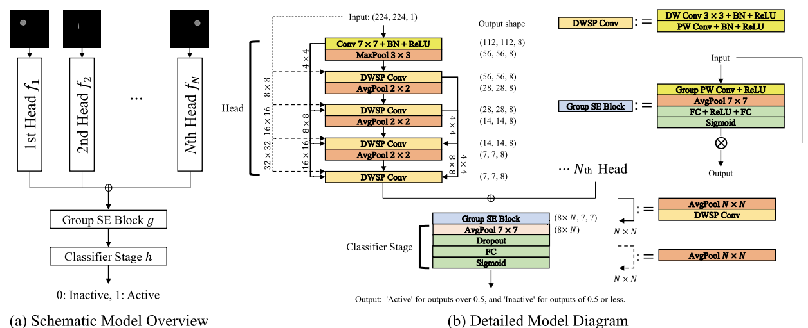

# PyTorch Implementation of Multihead Group SE Net
 
The architecture can be referenced by a manuscript entitled, "Multihead Neural Network for Multiple Segmented Images-Based Diagnosis of Thyroid-Associated Orbitopathy Activity." 

## Overview
This repository contains an official implementation of Multihead Group SE Net using PyTorch.<br/>


## Data preprocessing and Neural Network

## Paper
If you use this software for your research, please cite:

```bibtex
@article{lee2024multihead,
  title={Multihead Neural Network for Multiple Segmented Images-Based Diagnosis of Thyroid-Associated Orbitopathy Activity},
  author={Lee, Sanghyuck and Lee, Jeong Kyu and Lee, Jaesung},
  journal={IEEE Access},
  volume={12},
  pages={43862--43873},
  year={2024},
  publisher={IEEE}
}
```

## License
This program is available for download for non-commercial use, licensed under the GNU General Public License. This allows its use for research purposes or other free software projects but does not allow its incorporation into any type of commercial software.

## Files
The repository contains the following files:
- `Multihead_Group_SE_Net.py`: Python script file, containing the PyTorch implementation of the Multihead Group SE Net
- `Multihead_Group_SE_Net.png`: Figure file for network
- `README.md`: Markdown file explaining the model source code


